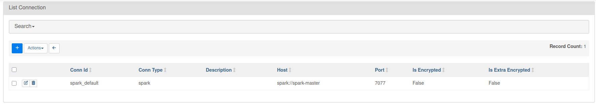

# NYC Taxi Data Streaming Pipeline - Setup Guide

## 1. Start Infrastructure Services

From the repository root:
```powershell
docker compose up -d
```

**Services started:**
- PostgreSQL (with logical replication)
- Kafka + Debezium Connect
- Spark Master/Worker + Thrift Server
- MinIO (S3-compatible storage)
- Hive Metastore
- **Streamlit Dashboard** (port 8501)
- Kafka UI (port 8080)

**Verify:**
```bash
# Check services are healthy
docker compose ps

# Verify connector is registered (should return: ["taxi-postgres-connector"])
curl http://localhost:8083/connectors

# Open Kafka UI (only if you are on powershell)
start http://localhost:8080
```

---

## 2. Install Python Dependencies
```bash
# Create and activate virtual environment (recommended)
python -m venv .venv
.\.venv\Scripts\Activate.ps1 # If on powershell
source .venv/bin/activate # If on Linux

# Install dependencies
pip install -r requirements.txt
```

---

## 3. Generate Taxi Trip Data

Writes directly to Postgres (exposed on localhost:5432). Runs continuously until stopped.
```bash
python src/data_generation/insert_taxi_data.py
```

---

## 4. Start Spark Streaming (Kafka → Iceberg)
```bash
python src/streaming/kafka_to_iceberg.py
```

---

## 5. Upload Taxi Zone Data to MinIO

- Open MinIO console at http://localhost:9001
- Upload `src/taxi_zone.csv`

---

## 6 Fix Airflow Write permission (if needed)

From the terminals, give permission to `./airflow/logs`

```bash
chmod -R 777 ./airflow/logs
```

Then, go to `localhost:8085`, set the Connection settings as in the image below:



Then, go to main page and start the `spark_lakehouse_pipeline`, and wait until `gold data` is generated.

## 7. Register Hive Tables

Next, create the `src/register_tables_beeline.sql` (contact us for detailed SQL Code)
```bash
touch src/register_tables_beeline.sql
```

Then, register the Gold layer tables for querying:
```bash
docker exec spark-thrift /opt/spark/bin/beeline -u jdbc:hive2://localhost:10000 -n hive -f /opt/spark/work-dir/src/register_tables_beeline.sql
```

If that registeration fails, run this command before submitting the gold layer tables again:
```bash
docker exec spark-thrift mkdir -p /opt/spark/work-dir/src
```

## 8. Access Streamlit Dashboard

Open the analytics dashboard:
```
http://localhost:8501
```

**Dashboard Features:**
- Executive Overview (KPIs)
- Revenue Deep-Dive (Payment types, Hourly patterns)
- Operations & Efficiency (Tips, Duration distribution)
- Geographic Intelligence (Zone heatmaps)

<video src="assets/dashboard_visualization.webm" controls width="600">
  Your browser does not support the video tag.
</video>

## 9. Set Up Flink and Cassandra

### Create Cassandra Tables
```bash
docker exec -it cassandra cqlsh
```
```sql
CREATE KEYSPACE IF NOT EXISTS realtime 
WITH replication = {'class': 'SimpleStrategy', 'replication_factor': 1};

CREATE TABLE IF NOT EXISTS realtime.revenue_minute (
    window_start timestamp PRIMARY KEY,
    window_end timestamp,
    total_revenue double,
    trip_count bigint
);

CREATE TABLE IF NOT EXISTS realtime.active_trips (
    window_start timestamp PRIMARY KEY,
    window_end timestamp,
    active_trips bigint
);
```

Type `exit` to close CQL shell.

### Build and Deploy Flink Application
```bash
cd src/flink

./gradlew clean shadowJar

docker cp app/build/libs/app-1.0-SNAPSHOT.jar flink-jobmanager:/opt/flink/

docker exec -it flink-jobmanager flink run \
  --class org.streaming.Application \
  /opt/flink/app-1.0-SNAPSHOT.jar
```

---

## 10. Tear Down

Stop and remove all containers and volumes:
```powershell
docker compose down -v
```